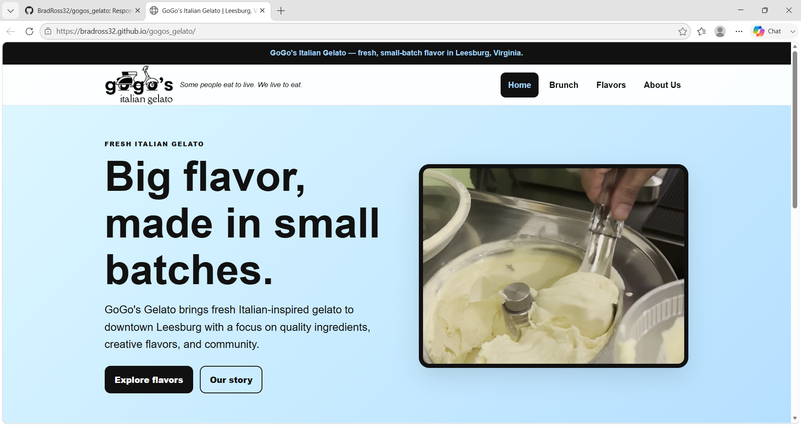
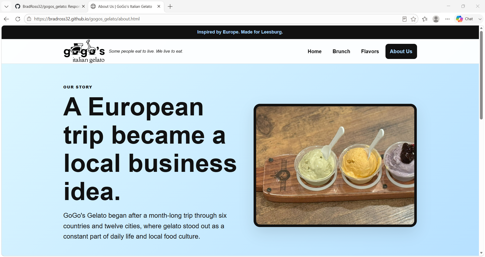
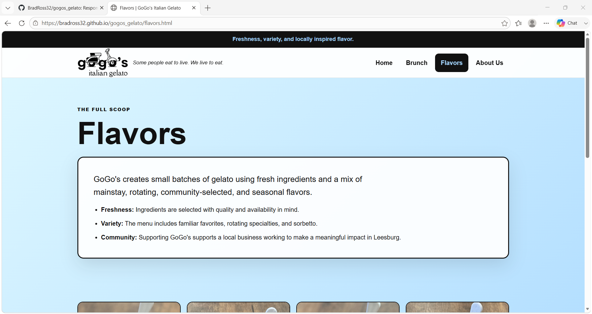
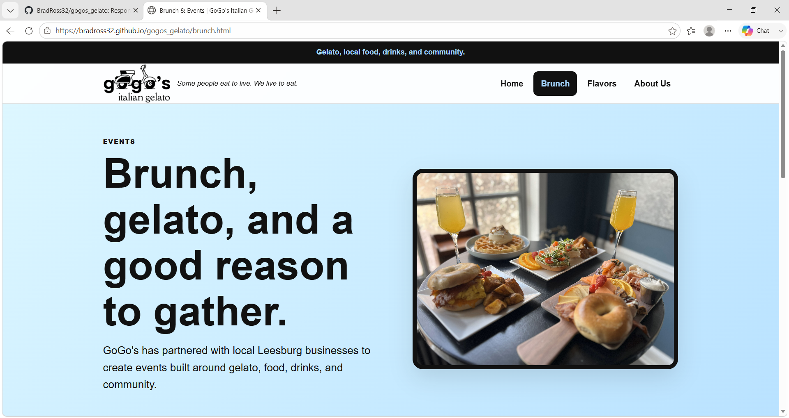

# GoGo's Italian Gelato

A responsive multi-page business website built using HTML5, CSS3, and JavaScript.

## Live Website

🌐 **Live Site:** https://bradross32.github.io/gogos-gelato/

## Overview

GoGo's Italian Gelato is a responsive business website created to showcase the business, its menu, brunch events, and location. The project demonstrates responsive web design, organized project structure, and clean front-end development.

## Technologies Used

- HTML5
- CSS3
- JavaScript
- Git
- GitHub

## Features

- Responsive multi-page website
- Mobile-friendly layout
- Reusable navigation
- Organized file structure
- Custom branding
- Updated 2026 business information

## Screenshots

### Home

### About

### Flavors

### Brunch & Events

## Future Improvements

- Contact form
- Online ordering
- Performance optimization

## Author

**Bradley Ross**

GitHub: https://github.com/BradRoss32
